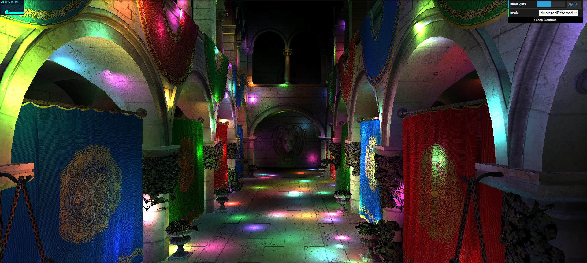
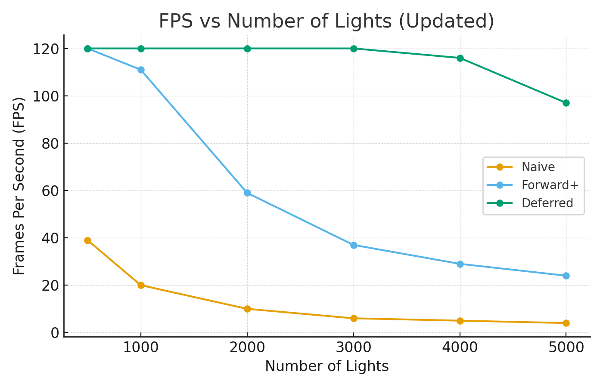
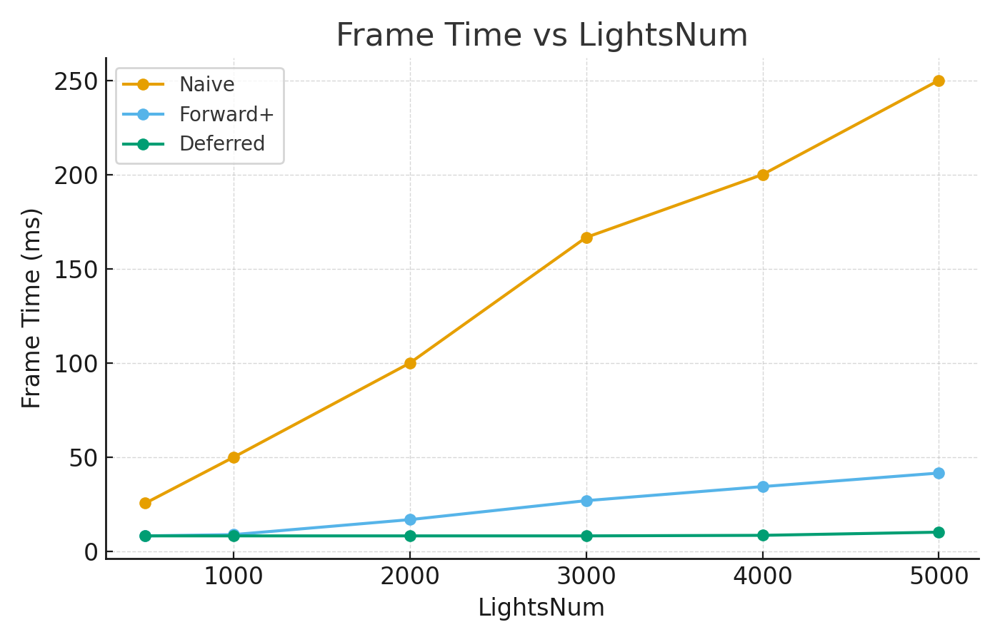
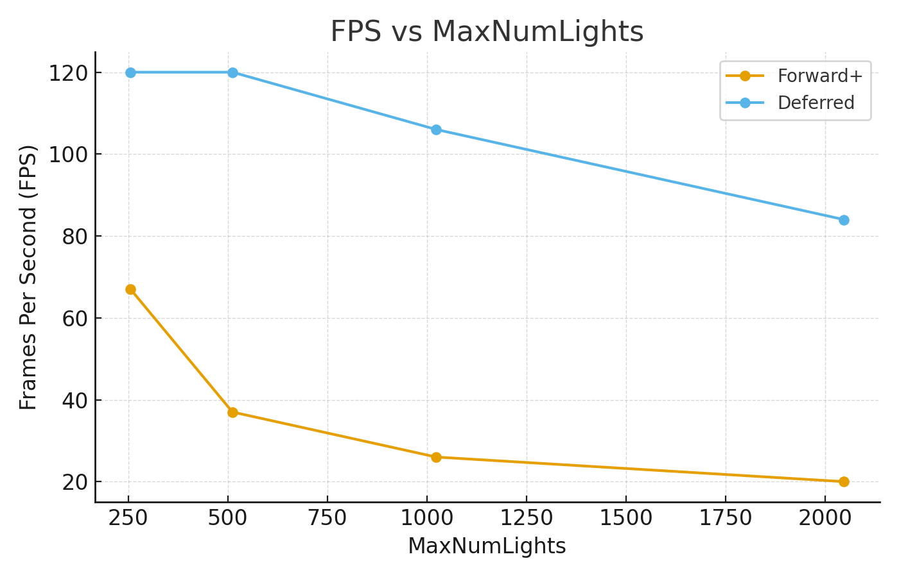
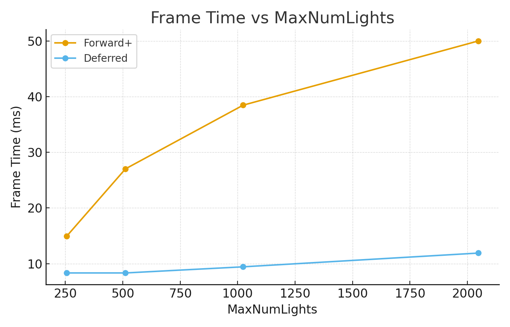

WebGL Forward+ and Clustered Deferred Shading
======================

**University of Pennsylvania, CIS 565: GPU Programming and Architecture, Project 4**

* Cecilia Chen 
  * [LinkedIn](https://www.linkedin.com/in/yue-chen-643182223/)
* Tested on: Windows 11, i7-13700F @ 2.1GHz 16GB, GeForce GTX 4070 12GB (Personal Computer)

### Live Demo

### Demo Video/GIF

### Project Overview

This project implements real-time lighting three ways, with a shared clustered light assignment pass:
* Naive Forward Shading — per-fragment loops over all lights (baseline).

* Light Clustering Compute — partitions the screen into 3D clusters (CLUSTER_X×CLUSTER_Y×CLUSTER_Z), computes conservative AABBs, assigns lights with a capped list per cluster.

* Forward+ (Clustered Forward) — compute pass builds per-cluster light lists; fragment shades using only lights for its cluster.

* Clustered Deferred Shading — geometry pass writes G-buffer (albedo, normal, linear view-Z), fullscreen pass shades per cluster.

### **Features** 

### Forward+ (Clustered Forward)
**Overview:** Adds a compute pass to bin lights into screen-space clusters; the fragment shades using only its cluster’s light list.

**Performance change:** Frame time rises with total lights (≈8.3→41.7 ms from 500→5000) and with the per-cluster/scene light cap (≈14.9→50.0 ms from 256→2048), reflecting longer light loops and bigger lists.

**Parameter effects (timing):** See plots—LightsNum increases cost roughly sublinearly due to culling; increasing MaxNumLights grows cost because more lights survive into each cluster’s list.

**Accelerations used:** Cluster culling and capped per-cluster lists; conservative AABB tests to reject lights early.

### Clustered Deferred

**Overview:** Two-pass shading: G-buffer geometry writes material/normal/depth; fullscreen pass shades using clustered light lists.

**Performance change:** Very stable with lights (≈8.3–10.3 ms up to 5000 lights) and only mildly sensitive to MaxNumLights (≈8.3→11.9 ms from 256→2048), dominated by G-buffer bandwidth and fixed fullscreen shading.

**Parameter effects (timing):** LightsNum mostly flat due to clustered pruning; MaxNumLights adds modest cost as per-pixel light loops lengthen. See plots.

**Accelerations used:** Linear world-Z reconstruction to avoid extra work; fullscreen triangle; clustered light indexing.

### Performance Analysis

Quick note on measurements: my direct ms timing failed (the timer kept returning 0 ms), so I reported FPS instead. Wherever you see “ms per frame,” it’s derived from FPS using ms = 1000 / FPS rather than captured from GPU timestamps—treat it as an estimate, not a hardware-timer reading.

#### Comparing the performance of different implements

*Setting: CLUSTER_X = 16, CLUSTER_Y = 9, CLUSTER_Z = 24, Max number of lights: 1200*

#### Analysis
* Deferred is the most stable and fastest overall (flat at ~120 FPS up to 3k lights, then tapering to 97 FPS at 5k) because shading work is decoupled from geometry and clustered light lists bound per pixel keep the per-fragment loop short

* Forward+ is excellent at low–mid counts (120 → 24 FPS from 500→5k) since per-tile culling trims the light loop but still pays the per-fragment BRDF and clustering overhead

* Naive collapses quickly (39 → 4 FPS) because it scales O(pixels×lights) with no culling.

#### Conclusion

Overall, Naive forward is the simplest and lightest pipeline—great when you have only a few lights and want built-in transparency and MSAA in one pass—but its cost scales as O(pixels × lights), so performance collapses as light counts rise and overdraw increases. Forward+ (clustered forward) adds a compute pass that bins lights into screen-space clusters, so fragments only loop the handful of nearby lights. Clustered deferred decouples geometry and lighting via a G-buffer, delivering very stable performance with many lights; however, it burns bandwidth and memory on multiple render targets and requires a separate forward path for transparency and special handling for material property packing/precision.

#### Comparing the performance of different number of lights per cluster

*Setting: CLUSTER_X = 16, CLUSTER_Y = 9, CLUSTER_Z = 24*

#### Analysis
As MaxNumLights decreases, FPS rises for both techniques because each pixel/cluster iterates over fewer candidate lights. This shows diminishing returns below ~512, where Deferred plateaus at 120 FPS and Forward+ still improves but with a smaller slope; the gains come from shorter per-fragment light loops, reduced memory traffic for per-cluster indices, and fewer cache misses. However, setting the cap too low can cause visible grid artifacts (tiled regions missing lights that were culled by the cap). A practical sweet spot is typically around 1024: it retain most of the performance win while minimizing the risk of under-lit tiles and noticeable grids.

### Credits

- [Vite](https://vitejs.dev/)
- [loaders.gl](https://loaders.gl/)
- [dat.GUI](https://github.com/dataarts/dat.gui)
- [stats.js](https://github.com/mrdoob/stats.js)
- [wgpu-matrix](https://github.com/greggman/wgpu-matrix)
